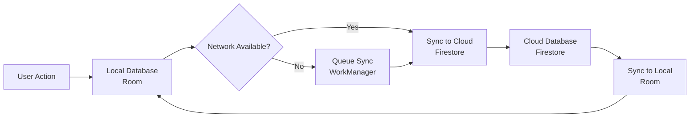

# Lab 3: Note-Taking App with Local Storage & Cloud Sync

Complete step-by-step guide.

## Introduction
This lab combines local database storage (Room) with cloud synchronization (Firebase Firestore) to create a robust, offline-first note-taking app. The architecture ensures data is always available locally, syncing with the cloud when connectivity is restored.

## Architecture Overview: Offline-First Approach



In this architecture, **Room is the single source of truth** for the UI 【turn0search6】. All reads come from the local database, and writes go to Room first, then sync to Firestore in the background. This ensures the app works perfectly offline, providing a seamless user experience.

## Step 1: Project Setup & Dependencies

Add these dependencies to your `build.gradle` (Module: app):

```gradle
dependencies {
    // Room for local database
    implementation("androidx.room:room-runtime:2.6.1")
    implementation("androidx.room:room-ktx:2.6.1")
    ksp("androidx.room:room-compiler:2.6.1") // Use kapt for Kotlin < 1.9

    // Firebase Firestore for cloud sync
    implementation(platform("com.google.firebase:firebase-bom:33.0.0"))
    implementation("com.google.firebase:firebase-firestore-ktx")

    // Coroutines for async operations
    implementation("org.jetbrains.kotlinx:kotlinx-coroutines-android:1.7.3")

    // WorkManager for background sync
    implementation("androidx.work:work-runtime-ktx:2.9.0")

    // Lifecycle components
    implementation("androidx.lifecycle:lifecycle-viewmodel-ktx:2.7.0")
    implementation("androidx.lifecycle:lifecycle-livedata-ktx:2.7.0")
}
```

Apply the Google services plugin in your project-level `build.gradle`:
```gradle
plugins {
    id("com.google.gms.google-services") version "4.4.0" apply false
}
```

## Step 2: Implement Local Storage with Room

### 2.1 Define Data Model
Create a data class representing a note with both local and cloud IDs:

```kotlin
// Note.kt
@Entity(tableName = "notes")
data class Note(
    @PrimaryKey(autoGenerate = true)
    val localId: Long = 0,
    val cloudId: String = "", // Firestore document ID
    val title: String,
    val content: String,
    val isDeleted: Boolean = false,
    val lastUpdated: Long = System.currentTimeMillis(),
    val isSynced: Boolean = false // Flag for sync status
)
```

### 2.2 Create Data Access Object (DAO)
Define database operations with conflict resolution strategies:

```kotlin
// NoteDao.kt
@Dao
interface NoteDao {
    @Insert(onConflict = OnConflictStrategy.REPLACE)
    suspend fun insertNote(note: Note): Long

    @Update
    suspend fun updateNote(note: Note)

    @Delete
    suspend fun deleteNote(note: Note)

    @Query("SELECT * FROM notes WHERE isDeleted = 0 ORDER BY lastUpdated DESC")
    fun getAllNotes(): Flow<List<Note>>

    @Query("SELECT * FROM notes WHERE isSynced = 0 AND isDeleted = 0")
    suspend fun getUnsyncedNotes(): List<Note>

    @Query("SELECT * FROM notes WHERE cloudId = :cloudId")
    suspend fun getNoteByCloudId(cloudId: String): Note?
}
```

### 2.3 Set Up Room Database
Create the database class with migration support:

```kotlin
// AppDatabase.kt
@Database(entities = [Note::class], version = 1, exportSchema = false)
abstract class AppDatabase : RoomDatabase() {
    abstract fun noteDao(): NoteDao

    companion object {
        @Volatile
        private var INSTANCE: AppDatabase? = null

        fun getDatabase(context: Context): AppDatabase {
            return INSTANCE ?: synchronized(this) {
                val instance = Room.databaseBuilder(
                    context.applicationContext,
                    AppDatabase::class.java,
                    "notes_database"
                )
                .addCallback(object : Callback() {
                    override fun onCreate(db: SupportSQLiteDatabase) {
                        super.onCreate(db)
                        // Pre-populate with sample data if needed
                    }
                })
                .build()
                INSTANCE = instance
                instance
            }
        }
    }
}
```

## Step 3: Implement Cloud Sync with Firebase Firestore

### 3.1 Initialize Firebase
Set up Firebase in your `Application` class or main activity:

```kotlin
// NoteApplication.kt
class NoteApplication : Application() {
    override fun onCreate() {
        super.onCreate()
        // Initialize Firebase
        Firebase.initialize(this)
        
        // Enable offline persistence for Firestore
        val firestore = Firebase.firestore
        firestore.firestoreSettings = firestoreSettings {
            isPersistenceEnabled = true
        }
    }
}
```

### 3.2 Create Sync Service
Implement a service that handles synchronization between Room and Firestore:

```kotlin
// SyncService.kt
class SyncService(private val context: Context) {
    private val db = AppDatabase.getDatabase(context)
    private val firestore = Firebase.firestore
    private val notesCollection = firestore.collection("notes")
    
    // Sync local changes to cloud
    suspend fun syncLocalToCloud() {
        val unsyncedNotes = db.noteDao().getUnsyncedNotes()
        
        for (note in unsyncedNotes) {
            try {
                val noteMap = note.toMap().apply {
                    remove("localId") // Don't store local ID in cloud
                    remove("isSynced") // Don't store sync flag in cloud
                }
                
                if (note.cloudId.isEmpty()) {
                    // New note - add to Firestore
                    val documentRef = notesCollection.add(noteMap).await()
                    db.noteDao().updateNote(note.copy(
                        cloudId = documentRef.id,
                        isSynced = true
                    ))
                } else {
                    // Existing note - update in Firestore
                    notesCollection.document(note.cloudId).set(noteMap).await()
                    db.noteDao().updateNote(note.copy(isSynced = true))
                }
            } catch (e: Exception) {
                // Handle sync failure (will retry later)
                Log.e("SyncService", "Sync failed for note ${note.localId}", e)
            }
        }
    }
    
    // Sync cloud changes to local
    suspend fun syncCloudToLocal() {
        try {
            val snapshot = notesCollection.get().await()
            val cloudNotes = snapshot.documents.mapNotNull { doc ->
                val noteMap = doc.data ?: return@mapNotNull null
                Note(
                    cloudId = doc.id,
                    title = noteMap["title"] as String,
                    content = noteMap["content"] as String,
                    isDeleted = noteMap["isDeleted"] as Boolean? ?: false,
                    lastUpdated = noteMap["lastUpdated"] as Long? ?: System.currentTimeMillis(),
                    isSynced = true
                )
            }
            
            // Update local database with cloud data
            for (cloudNote in cloudNotes) {
                val localNote = db.noteDao().getNoteByCloudId(cloudNote.cloudId)
                if (localNote == null) {
                    // New cloud note - insert locally
                    db.noteDao().insertNote(cloudNote)
                } else if (cloudNote.lastUpdated > localNote.lastUpdated) {
                    // Cloud version is newer - update local
                    db.noteDao().updateNote(cloudNote.copy(localId = localNote.localId))
                }
            }
        } catch (e: Exception) {
            Log.e("SyncService", "Cloud to local sync failed", e)
        }
    }
    
    // Full sync (both directions)
    suspend fun fullSync() {
        syncCloudToLocal()
        syncLocalToCloud()
    }
    
    // Extension function to convert Note to Map
    private fun Note.toMap(): Map<String, Any?> {
        return mapOf(
            "cloudId" to cloudId,
            "title" to title,
            "content" to content,
            "isDeleted" to isDeleted,
            "lastUpdated" to lastUpdated
        )
    }
}
```

## Step 4: Implement Background Sync with WorkManager

Create a Worker that periodically syncs data in the background:

```kotlin
// SyncWorker.kt
class SyncWorker(
    context: Context,
    workerParams: WorkerParameters
) : CoroutineWorker(context, workerParams) {
    
    override suspend fun doWork(): Result {
        val syncService = SyncService(applicationContext)
        
        return try {
            syncService.fullSync()
            Result.success()
        } catch (e: Exception) {
            Log.e("SyncWorker", "Background sync failed", e)
            Result.retry() // Will retry with backoff
        }
    }
    
    companion object {
        private const val UNIQUE_WORK_NAME = "note_periodic_sync"
        
        fun schedulePeriodicSync(context: Context) {
            val syncRequest = PeriodicWorkRequestBuilder<SyncWorker>(
                15, TimeUnit.MINUTES // Minimum interval allowed
            )
                .setConstraints(Constraints.Builder()
                    .setRequiredNetworkType(NetworkType.CONNECTED)
                    .build())
                .setBackoffCriteria(
                    BackoffPolicy.LINEAR,
                    10, TimeUnit.MINUTES
                )
                .build()
            
            WorkManager.getInstance(context).enqueueUniquePeriodicWork(
                UNIQUE_WORK_NAME,
                ExistingPeriodicWorkPolicy.KEEP,
                syncRequest
            )
        }
        
        fun cancelPeriodicSync(context: Context) {
            WorkManager.getInstance(context).cancelUniqueWork(UNIQUE_WORK_NAME)
        }
    }
}
```

## Step 5: Create Repository with Offline-First Logic

The repository coordinates between local and cloud data sources:

```kotlin
// NoteRepository.kt
class NoteRepository(private val context: Context) {
    private val noteDao = AppDatabase.getDatabase(context).noteDao()
    private val syncService = SyncService(context)
    
    // Get all notes (from local database - single source of truth)
    fun getAllNotes(): Flow<List<Note>> {
        return noteDao.getAllNotes()
    }
    
    // Create a new note
    suspend fun createNote(title: String, content: String): Long {
        val note = Note(
            title = title,
            content = content,
            lastUpdated = System.currentTimeMillis(),
            isSynced = false
        )
        val localId = noteDao.insertNote(note)
        
        // Trigger immediate sync for new note
        syncService.syncLocalToCloud()
        
        return localId
    }
    
    // Update existing note
    suspend fun updateNote(note: Note) {
        val updatedNote = note.copy(
            lastUpdated = System.currentTimeMillis(),
            isSynced = false
        )
        noteDao.updateNote(updatedNote)
        
        // Trigger immediate sync
        syncService.syncLocalToCloud()
    }
    
    // Delete note (soft delete)
    suspend fun deleteNote(note: Note) {
        val deletedNote = note.copy(
            isDeleted = true,
            lastUpdated = System.currentTimeMillis(),
            isSynced = false
        )
        noteDao.updateNote(deletedNote)
        
        // Trigger immediate sync
        syncService.syncLocalToCloud()
    }
    
    // Force sync from UI
    suspend fun forceSync() {
        syncService.fullSync()
    }
    
    // Initialize periodic sync
    fun initializePeriodicSync() {
        SyncWorker.schedulePeriodicSync(context)
    }
}
```

## Step 6: Build UI with ViewModel

Create a ViewModel that follows the offline-first principle:

```kotlin
// NoteViewModel.kt
class NoteViewModel(application: Application) : AndroidViewModel(application) {
    private val repository = NoteRepository(application)
    
    // All notes from local database (offline-first)
    val allNotes: LiveData<List<Note>> = repository.getAllNotes().asLiveData()
    
    // Create new note
    fun createNote(title: String, content: String) {
        viewModelScope.launch {
            repository.createNote(title, content)
        }
    }
    
    // Update note
    fun updateNote(note: Note) {
        viewModelScope.launch {
            repository.updateNote(note)
        }
    }
    
    // Delete note
    fun deleteNote(note: Note) {
        viewModelScope.launch {
            repository.deleteNote(note)
        }
    }
    
    // Force sync
    fun forceSync() {
        viewModelScope.launch {
            repository.forceSync()
        }
    }
    
    // Initialize periodic sync
    init {
        repository.initializePeriodicSync()
    }
}
```

## Step 7: Create UI with Jetpack Compose (Optional)

Here's a simple Compose UI for the note list:

```kotlin
// NoteListScreen.kt
@Composable
fun NoteListScreen(
    notes: List<Note>,
    onNoteClick: (Note) -> Unit,
    onAddNoteClick: () -> Unit
) {
    Scaffold(
        floatingActionButton = {
            FloatingActionButton(onClick = onAddNoteClick) {
                Icon(Icons.Default.Add, contentDescription = "Add Note")
            }
        }
    ) { padding ->
        LazyColumn(
            modifier = Modifier
                .fillMaxSize()
                .padding(padding)
        ) {
            items(notes) { note ->
                NoteItem(
                    note = note,
                    onClick = { onNoteClick(note) }
                )
            }
        }
    }
}

@Composable
fun NoteItem(note: Note, onClick: () -> Unit) {
    Card(
        modifier = Modifier
            .fillMaxWidth()
            .padding(8.dp)
            .clickable(onClick = onClick)
    ) {
        Column(
            modifier = Modifier.padding(16.dp)
        ) {
            Text(
                text = note.title,
                style = MaterialTheme.typography.titleMedium,
                fontWeight = FontWeight.Bold
            )
            Spacer(modifier = Modifier.height(4.dp))
            Text(
                text = note.content,
                style = MaterialTheme.typography.bodyMedium,
                maxLines = 2,
                overflow = TextOverflow.Ellipsis
            )
            Spacer(modifier = Modifier.height(8.dp))
            Row(
                modifier = Modifier.fillMaxWidth(),
                horizontalArrangement = Arrangement.SpaceBetween
            ) {
                Text(
                    text = formatDate(note.lastUpdated),
                    style = MaterialTheme.typography.bodySmall
                )
                SyncStatusIcon(isSynced = note.isSynced)
            }
        }
    }
}

@Composable
fun SyncStatusIcon(isSynced: Boolean) {
    Icon(
        imageVector = if (isSynced) Icons.Default.CheckCircle else Icons.Default.CloudOff,
        contentDescription = if (isSynced) "Synced" else "Pending sync",
        tint = if (isSynced) Color.Green else Color.Orange,
        modifier = Modifier.size(16.dp)
    )
}
```

## Step 8: Conflict Resolution Strategies

Implement conflict resolution for simultaneous edits:

```kotlin
// ConflictResolution.kt
enum class ResolutionStrategy {
    LAST_WRITE_WINS,
    CLOUD_WINS,
    LOCAL_WINS,
    MERGE
}

class ConflictResolver(private val strategy: ResolutionStrategy = ResolutionStrategy.LAST_WRITE_WINS) {
    
    fun resolve(local: Note, cloud: Note): Note {
        return when (strategy) {
            ResolutionStrategy.LAST_WRITE_WINS -> {
                if (local.lastUpdated > cloud.lastUpdated) local else cloud
            }
            ResolutionStrategy.CLOUD_WINS -> cloud
            ResolutionStrategy.LOCAL_WINS -> local
            ResolutionStrategy.MERGE -> mergeNotes(local, cloud)
        }
    }
    
    private fun mergeNotes(local: Note, cloud: Note): Note {
        // Simple merge: concatenate content with timestamps
        val mergedContent = buildString {
            append(local.content)
            append("\n\n---\n")
            append("Cloud update at ${formatDate(cloud.lastUpdated)}:\n")
            append(cloud.content)
        }
        
        return local.copy(
            content = mergedContent,
            lastUpdated = maxOf(local.lastUpdated, cloud.lastUpdated),
            isSynced = false
        )
    }
}
```

## Step 9: Final App Integration

Tie everything together in your main activity:

```kotlin
// MainActivity.kt
class MainActivity : ComponentActivity() {
    private val viewModel: NoteViewModel by viewModels()
    
    override fun onCreate(savedInstanceState: Bundle?) {
        super.onCreate(savedInstanceState)
        
        setContent {
            MaterialTheme {
                Surface(
                    modifier = Modifier.fillMaxSize(),
                    color = MaterialTheme.colorScheme.background
                ) {
                    NoteApp(viewModel)
                }
            }
        }
        
        // Check network connectivity and sync
        checkConnectivityAndSync()
    }
    
    private fun checkConnectivityAndSync() {
        val connectivityManager = getSystemService(Context.CONNECTIVITY_SERVICE) as ConnectivityManager
        val networkInfo = connectivityManager.activeNetworkInfo
        val isConnected = networkInfo?.isConnectedOrConnecting == true
        
        if (isConnected) {
            viewModel.forceSync()
        }
    }
}

@Composable
fun NoteApp(viewModel: NoteViewModel) {
    val notes by viewModel.allNotes.observeAsState(initial = emptyList())
    var showAddDialog by remember { mutableStateOf(false) }
    var selectedNote by remember { mutableStateOf<Note?>(null) }
    
    NoteListScreen(
        notes = notes,
        onNoteClick = { note -> selectedNote = note },
        onAddNoteClick = { showAddDialog = true }
    )
    
    if (showAddDialog) {
        AddNoteDialog(
            onDismiss = { showAddDialog = false },
            onConfirm = { title, content ->
                viewModel.createNote(title, content)
                showAddDialog = false
            }
        )
    }
    
    selectedNote?.let { note ->
        NoteDetailScreen(
            note = note,
            onDismiss = { selectedNote = null },
            onUpdate = { updatedNote ->
                viewModel.updateNote(updatedNote)
                selectedNote = null
            },
            onDelete = {
                viewModel.deleteNote(note)
                selectedNote = null
            }
        )
    }
}
```

## Testing the Implementation

### Test Scenarios:
1. **Create note offline**: Create a note with no internet → Should save locally with `isSynced = false`
2. **Sync on reconnect**: Reconnect to internet → Note should sync to Firestore
3. **Edit conflict**: Edit same note on two devices → Conflict resolution should apply
4. **Background sync**: Close app → WorkManager should sync every 15 minutes
5. **Delete sync**: Delete note locally → Should soft delete and sync to cloud

### Debugging Tips:
- Enable Firestore offline persistence: `firestoreSettings { isPersistenceEnabled = true }`
- Log sync operations: `Log.d("Sync", "Local to cloud sync started")`
- Monitor WorkManager: `WorkManager.getInstance(context).getWorkInfosForUniqueWorkLiveData("note_periodic_sync")`
- Check sync status in UI with the `SyncStatusIcon` component

## Best Practices & Optimization

<summary> Advanced Optimization Techniques</summary>

1. **Batch Operations**: Group multiple sync operations to reduce network calls
2. **Differential Sync**: Only sync changed fields instead of entire documents
3. **Compression**: Compress note content before syncing
4. **Retry Logic**: Implement exponential backoff for failed syncs
5. **Rate Limiting**: Prevent excessive sync calls with debouncing
6. **Data Validation**: Validate data before sync to prevent cloud corruption
7. **Security Rules**: Implement proper Firestore security rules for data protection

```kotlin
// Example: Batch sync for multiple notes
suspend fun batchSync(notes: List<Note>) {
    val batch = firestore.batch()
    notes.forEach { note ->
        val docRef = if (note.cloudId.isEmpty()) {
            notesCollection.document()
        } else {
            notesCollection.document(note.cloudId)
        }
        batch.set(docRef, note.toMap())
    }
    batch.commit().await()
}
```
