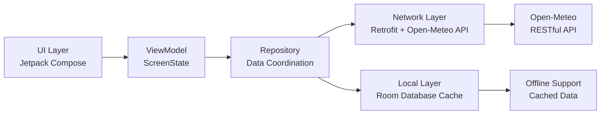

# Lab 4: Build a Weather App with Open RESTful API
Complete step-by-step guide.

## Lab Overview
In this lab, you'll build a fully functional weather app that consumes a RESTful API, following modern Android development practices. We'll use the **Open-Meteo API**, a free, open-source weather API that requires no API key, making it perfect for learning and prototyping.

## Architecture: MVVM with Clean Architecture Layers



## Step 1: Project Setup & Dependencies

### 1.1 Create New Project
Create a new Android project with **Jetpack Compose** and **Kotlin**.

### 1.2 Add Dependencies
Add these to your `build.gradle.kts` (Module: app):

```kotlin
dependencies {
    // Compose
    implementation(platform("androidx.compose:compose-bom:2024.06.00"))
    implementation("androidx.compose.ui:ui")
    implementation("androidx.compose.material3:material3")
    implementation("androidx.compose.ui:ui-tooling-preview")
    debugImplementation("androidx.compose.ui:ui-tooling")

    // Lifecycle & ViewModel
    implementation("androidx.lifecycle:lifecycle-viewmodel-compose:2.7.0")
    implementation("androidx.lifecycle:lifecycle-runtime-compose:2.7.0")

    // Networking
    implementation("com.squareup.retrofit2:retrofit:2.11.0")
    implementation("com.squareup.retrofit2:converter-gson:2.11.0")
    implementation("com.squareup.okhttp3:okhttp:4.12.0")
    implementation("com.squareup.okhttp3:logging-interceptor:4.12.0")

    // Coroutines
    implementation("org.jetbrains.kotlinx:kotlinx-coroutines-android:1.7.3")

    // Location
    implementation("com.google.android.gms:play-services-location:21.0.1")

    // Room for caching
    implementation("androidx.room:room-runtime:2.6.1")
    implementation("androidx.room:room-ktx:2.6.1")
    ksp("androidx.room:room-compiler:2.6.1")
}
```

## Step 2: Network Layer with Retrofit

### 2.1 Define API Service Interface
Create an interface for the Open-Meteo API:

```kotlin
// WeatherApiService.kt
interface WeatherApiService {
    @GET("v1/forecast")
    suspend fun getCurrentWeather(
        @Query("latitude") lat: Double,
        @Query("longitude") lon: Double,
        @Query("current") current: String = "temperature_2m,relative_humidity_2m,weather_code,wind_speed_10m",
        @Query("timezone") timezone: String = "auto"
    ): WeatherResponse

    companion object {
        const val BASE_URL = "https://api.open-meteo.com/"
    }
}

// Data classes for API response
data class WeatherResponse(
    val current: CurrentWeather?
)

data class CurrentWeather(
    val time: String?,
    val temperature_2m: Double?,
    val relative_humidity_2m: Int?,
    val weather_code: Int?,
    val wind_speed_10m: Double?
)
```

### 2.2 Create Retrofit Instance
Set up Retrofit with logging and Gson converter:

```kotlin
// RetrofitClient.kt
object RetrofitClient {
    private val loggingInterceptor = HttpLoggingInterceptor().apply {
        level = HttpLoggingInterceptor.Level.BODY
    }

    private val okHttpClient = OkHttpClient.Builder()
        .addInterceptor(loggingInterceptor)
        .connectTimeout(30, TimeUnit.SECONDS)
        .readTimeout(30, TimeUnit.SECONDS)
        .build()

    val instance: WeatherApiService by lazy {
        Retrofit.Builder()
            .baseUrl(WeatherApiService.BASE_URL)
            .client(okHttpClient)
            .addConverterFactory(GsonConverterFactory.create())
            .build()
            .create(WeatherApiService::class.java)
    }
}
```

## Step 3: Repository Pattern with Caching

### 3.1 Create Repository
Implement a repository that coordinates network and local data sources:

```kotlin
// WeatherRepository.kt
class WeatherRepository(
    private val apiService: WeatherApiService,
    private val weatherDao: WeatherDao
) {
    // Get weather from network or cache
    fun getWeather(lat: Double, lon: Double): Flow<WeatherState> = flow {
        emit(WeatherState.Loading)
        
        try {
            // Try to get from network
            val response = apiService.getCurrentWeather(lat, lon)
            if (response.current != null) {
                val weather = mapToWeatherEntity(response.current, lat, lon)
                
                // Cache locally
                weatherDao.insertWeather(weather)
                
                emit(WeatherState.Success(mapToWeatherUi(weather)))
            } else {
                emit(WeatherState.Error("Invalid API response"))
            }
        } catch (e: Exception) {
            // Network failed, try cache
            val cachedWeather = weatherDao.getWeatherForLocation(lat, lon)
            if (cachedWeather != null) {
                emit(WeatherState.Success(mapToWeatherUi(cachedWeather)))
            } else {
                emit(WeatherState.Error("Network error: ${e.localizedMessage}"))
            }
        }
    }

    private fun mapToWeatherEntity(current: CurrentWeather, lat: Double, lon: Double): WeatherEntity {
        return WeatherEntity(
            latitude = lat,
            longitude = lon,
            temperature = current.temperature_2m ?: 0.0,
            humidity = current.relative_humidity_2m ?: 0,
            weatherCode = current.weather_code ?: 0,
            windSpeed = current.wind_speed_10m ?: 0.0,
            timestamp = System.currentTimeMillis()
        )
    }

    private fun mapToWeatherUi(entity: WeatherEntity): WeatherUi {
        return WeatherUi(
            temperature = entity.temperature,
            humidity = entity.humidity,
            weatherCondition = mapWeatherCode(entity.weatherCode),
            windSpeed = entity.windSpeed,
            location = "${entity.latitude}, ${entity.longitude}"
        )
    }

    private fun mapWeatherCode(code: Int): String {
        return when (code) {
            0 -> "Clear sky"
            1, 2, 3 -> "Partly cloudy"
            45, 48 -> "Fog"
            51, 53, 55 -> "Drizzle"
            61, 63, 65 -> "Rain"
            71, 73, 75 -> "Snow"
            80, 81, 82 -> "Rain showers"
            95, 96, 99 -> "Thunderstorm"
            else -> "Unknown"
        }
    }
}

// UI State
sealed class WeatherState {
    object Loading : WeatherState()
    data class Success(val weather: WeatherUi) : WeatherState()
    data class Error(val message: String) : WeatherState()
}

data class WeatherUi(
    val temperature: Double,
    val humidity: Int,
    val weatherCondition: String,
    val windSpeed: Double,
    val location: String
)
```

## Step 4: UI Layer with Jetpack Compose

### 4.1 Create Weather Screen
Build the main weather screen with Compose:

```kotlin
// WeatherScreen.kt
@Composable
fun WeatherScreen(
    viewModel: WeatherViewModel = viewModel()
) {
    val weatherState by viewModel.weatherState.collectAsStateWithLifecycle()
    val locationPermissionState = rememberPermissionState(
        permission = Manifest.permission.ACCESS_COARSE_LOCATION
    )

    LaunchedEffect(locationPermissionState) {
        if (locationPermissionState.status.isGranted) {
            viewModel.fetchWeatherForCurrentLocation()
        } else {
            locationPermissionState.launchPermissionRequest()
        }
    }

    Box(
        modifier = Modifier
            .fillMaxSize()
            .padding(16.dp)
    ) {
        when (weatherState) {
            is WeatherState.Loading -> {
                CircularProgressIndicator(
                    modifier = Modifier.align(Alignment.CenterHorizontally)
                )
            }
            is WeatherState.Success -> {
                WeatherContent(
                    weather = (weatherState as WeatherState.Success).weather,
                    onRefresh = { viewModel.refreshWeather() }
                )
            }
            is WeatherState.Error -> {
                ErrorContent(
                    message = (weatherState as WeatherState.Error).message,
                    onRetry = { viewModel.retry() }
                )
            }
        }
    }
}

@Composable
fun WeatherContent(weather: WeatherUi, onRefresh: () -> Unit) {
    Column(
        modifier = Modifier.fillMaxSize(),
        verticalArrangement = Arrangement.spacedBy(16.dp)
    ) {
        // Location header
        Text(
            text = weather.location,
            style = MaterialTheme.typography.titleLarge,
            fontWeight = FontWeight.Bold
        )

        // Main weather card
        Card(
            modifier = Modifier.fillMaxWidth(),
            colors = CardDefaults.cardColors(
                containerColor = MaterialTheme.colorScheme.primaryContainer
            )
        ) {
            Column(
                modifier = Modifier.padding(16.dp)
            ) {
                Text(
                    text = "${weather.temperature}°C",
                    style = MaterialTheme.typography.displayLarge
                )
                Text(
                    text = weather.weatherCondition,
                    style = MaterialTheme.typography.titleMedium
                )
                Spacer(modifier = Modifier.height(8.dp))
                Row(
                    modifier = Modifier.fillMaxWidth(),
                    horizontalArrangement = Arrangement.SpaceBetween
                ) {
                    WeatherInfoItem("Humidity", "${weather.humidity}%")
                    WeatherInfoItem("Wind", "${weather.windSpeed} km/h")
                }
            }
        }

        // Refresh button
        Button(
            onClick = onRefresh,
            modifier = Modifier.align(Alignment.CenterHorizontally)
        ) {
            Text("Refresh")
        }
    }
}

@Composable
fun WeatherInfoItem(label: String, value: String) {
    Column {
        Text(
            text = label,
            style = MaterialTheme.typography.bodySmall
        )
        Text(
            text = value,
            style = MaterialTheme.typography.bodyMedium
        )
    }
}
```

## Step 5: Location Services

### 5.1 Get Current Location
Use FusedLocationProviderClient to get device location:

```kotlin
// LocationHelper.kt
class LocationHelper(private val context: Context) {
    private var fusedLocationClient: FusedLocationProviderClient = 
        LocationServices.getFusedLocationProviderClient(context)

    @SuppressLint("MissingPermission")
    fun getCurrentLocation(): Flow<Location?> = callbackFlow {
        val locationRequest = LocationRequest.Builder(
            Priority.PRIORITY_BALANCED_POWER_ACCURACY,
            10000
        ).build()

        val locationCallback = object : LocationCallback() {
            override fun onLocationResult(locationResult: LocationResult) {
                locationResult.lastLocation?.let { location ->
                    trySend(location)
                }
            }
        }

        fusedLocationClient.requestLocationUpdates(
            locationRequest,
            locationCallback,
            Looper.getMainLooper()
        )

        awaitClose {
            fusedLocationClient.removeLocationUpdates(locationCallback)
        }
    }
}
```

## Step 6: ViewModel with State Management

### 6.1 Create ViewModel
Implement ViewModel that handles state and coordinates repository:

```kotlin
// WeatherViewModel.kt
class WeatherViewModel(
    private val weatherRepository: WeatherRepository
) : ViewModel() {

    private val _weatherState = MutableStateFlow<WeatherState>(WeatherState.Loading)
    val weatherState: StateFlow<WeatherState> = _weatherState.asStateFlow()

    private val locationHelper = LocationHelper(application)

    init {
        fetchWeatherForCurrentLocation()
    }

    fun fetchWeatherForCurrentLocation() {
        viewModelScope.launch {
            locationHelper.getCurrentLocation().collect { location ->
                if (location != null) {
                    fetchWeather(location.latitude, location.longitude)
                } else {
                    _weatherState.value = WeatherState.Error("Unable to get location")
                }
            }
        }
    }

    fun fetchWeather(lat: Double, lon: Double) {
        viewModelScope.launch {
            weatherRepository.getWeather(lat, lon).collect { state ->
                _weatherState.value = state
            }
        }
    }

    fun refreshWeather() {
        fetchWeatherForCurrentLocation()
    }

    fun retry() {
        fetchWeatherForCurrentLocation()
    }
}
```

## Step 7: Testing the App


### 7.2 Unit Tests Example
```kotlin
// WeatherRepositoryTest.kt
class WeatherRepositoryTest {
    private lateinit var repository: WeatherRepository
    private lateinit var apiService: WeatherApiService
    private lateinit var weatherDao: WeatherDao

    @Before
    fun setup() {
        apiService = mockk()
        weatherDao = mockk()
        repository = WeatherRepository(apiService, weatherDao)
    }

    @Test
    fun `getWeather success emits Success state`() = runTest {
        // Given
        val response = WeatherResponse(CurrentWeather(/* test data */))
        coEvery { apiService.getCurrentWeather(any(), any()) } returns response
        coEvery { weatherDao.insertWeather(any()) } just Runs

        // When
        val result = repository.getWeather(0.0, 0.0).first()

        // Then
        assertTrue(result is WeatherState.Success)
    }
}
```

## Step 8: Advanced Features (Optional)

<summary> Advanced Implementation Details</summary>

### 8.1 Hourly Forecast
Extend the API interface to include hourly forecast:

```kotlin
@GET("v1/forecast")
suspend fun getHourlyForecast(
    @Query("latitude") lat: Double,
    @Query("longitude") lon: Double,
    @Query("hourly") hourly: String = "temperature_2m,weather_code",
    @Query("forecast_days") days: Int = 7
): HourlyForecastResponse
```

### 8.2 Weather Alerts
Implement notifications for severe weather:

```kotlin
// NotificationHelper.kt
class NotificationHelper(private val context: Context) {
    fun showWeatherAlert(weatherCode: Int) {
        if (weatherCode >= 95) { // Thunderstorm codes
            val notification = NotificationCompat.Builder(context, CHANNEL_ID)
                .setSmallIcon(R.drawable.ic_weather_alert)
                .setContentTitle("Weather Alert")
                .setContentText("Severe weather detected in your area")
                .setPriority(NotificationCompat.PRIORITY_HIGH)
                .build()

            NotificationManagerCompat.from(context).notify(1, notification)
        }
    }
}
```

### 8.3 Widget Support
Add a home screen widget for quick weather updates:

```kotlin
// WeatherWidget.kt
class WeatherWidget : AppWidgetProvider() {
    override fun onUpdate(
        context: Context,
        appWidgetManager: AppWidgetManager,
        appWidgetIds: IntArray
    ) {
        // Update widget with latest weather data
    }
}
```

## API Comparison: Open-Meteo vs OpenWeatherMap

| Feature | Open-Meteo | OpenWeatherMap |
|---------|------------|----------------|
| **Cost** | Free for non-commercial use | Requires API key |
| **API Key** | Not required | Required |
| **Data Quality** | High accuracy | High accuracy |
| **Rate Limits** | Generous | Limited on free plan |
| **Ease of Use** | Simple, clean API | More complex endpoints |
| **Documentation** | Clear and concise | Comprehensive |

## Next Practice Steps

1. **Add 7-day forecast** using Open-Meteo's daily endpoint
2. **Implement search** for different locations
3. **Add settings** for temperature units (°C/°F)
4. **Implement dark mode** support
5. **Add animations** for weather transitions
6. **Implement offline sync** with WorkManager
