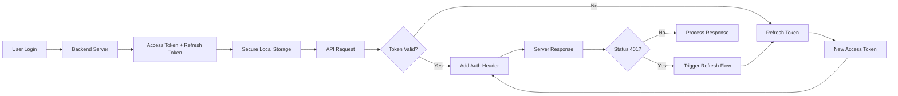

# Lab 7: Implement a Login System with Secure Token-Based Authentication

Complete step-by-step guide. 

## Lab Overview
This lab implements a complete, secure token-based authentication system for Android. You'll learn to handle login, token storage, automatic token refresh, and secure API request signing using Retrofit and OkHttp interceptors.

## Architecture Overview



## Step 1: Project Setup & Dependencies

Add the following dependencies to your app-level `build.gradle.kts`:

```kotlin
dependencies {
    // Networking
    implementation("com.squareup.retrofit2:retrofit:2.11.0")
    implementation("com.squareup.retrofit2:converter-gson:2.11.0")
    implementation("com.squareup.okhttp3:okhttp:4.12.0")
    implementation("com.squareup.okhttp3:logging-interceptor:4.12.0")

    // Coroutines
    implementation("org.jetbrains.kotlinx:kotlinx-coroutines-android:1.7.3")

    // Lifecycle & ViewModel
    implementation("androidx.lifecycle:lifecycle-viewmodel-compose:2.7.0")
    implementation("androidx.lifecycle:lifecycle-runtime-compose:2.7.0")

    // DataStore for secure token storage (preferred over EncryptedSharedPreferences)
    implementation("androidx.datastore:datastore-preferences:1.0.0")

    // Security crypto for encrypted storage (if needed)
    implementation("androidx.security:security-crypto:1.1.0-alpha06")
}
```

> **Note**: EncryptedSharedPreferences is deprecated. Use DataStore with encryption or the Android Keystore directly for new projects.

## Step 2: Secure Token Storage

### 2.1 Create Token Manager
Implement a secure token manager using DataStore with encryption:

```kotlin
// TokenManager.kt
import android.content.Context
import androidx.datastore.core.DataStore
import androidx.datastore.preferences.core.Preferences
import androidx.datastore.preferences.core.edit
import androidx.datastore.preferences.core.stringPreferencesKey
import androidx.datastore.preferences.preferencesDataStore
import kotlinx.coroutines.flow.Flow
import kotlinx.coroutines.flow.map

class TokenManager(private val context: Context) {
    
    // Create DataStore with encrypted file
    private val Context.dataStore: DataStore<Preferences> by preferencesDataStore(
        name = "secure_auth_prefs",
        produceMigrations = { listOf(EncryptedSharedPreferencesMigration(context)) }
    )
    
    companion object {
        private val ACCESS_TOKEN_KEY = stringPreferencesKey("access_token")
        private val REFRESH_TOKEN_KEY = stringPreferencesKey("refresh_token")
        private val TOKEN_EXPIRY_KEY = stringPreferencesKey("token_expiry")
    }
    
    // Save tokens after login
    suspend fun saveTokens(accessToken: String, refreshToken: String, expiresIn: Long) {
        context.dataStore.edit { preferences ->
            preferences[ACCESS_TOKEN_KEY] = accessToken
            preferences[REFRESH_TOKEN_KEY] = refreshToken
            preferences[TOKEN_EXPIRY_KEY] = (System.currentTimeMillis() + expiresIn * 1000).toString()
        }
    }
    
    // Get access token
    fun getAccessToken(): Flow<String?> {
        return context.dataStore.data.map { preferences ->
            preferences[ACCESS_TOKEN_KEY]
        }
    }
    
    // Get refresh token
    fun getRefreshToken(): Flow<String?> {
        return context.dataStore.data.map { preferences ->
            preferences[REFRESH_TOKEN_KEY]
        }
    }
    
    // Check if token is expired
    fun isTokenExpired(): Flow<Boolean> {
        return context.dataStore.data.map { preferences ->
            val expiry = preferences[TOKEN_EXPIRY_KEY]?.toLongOrNull() ?: 0L
            System.currentTimeMillis() >= expiry
        }
    }
    
    // Clear tokens on logout
    suspend fun clearTokens() {
        context.dataStore.edit { preferences ->
            preferences.remove(ACCESS_TOKEN_KEY)
            preferences.remove(REFRESH_TOKEN_KEY)
            preferences.remove(TOKEN_EXPIRY_KEY)
        }
    }
}
```

### 2.2 Encrypted SharedPreferences Migration (Optional)
For migrating from deprecated EncryptedSharedPreferences:

```kotlin
// EncryptedSharedPreferencesMigration.kt
import android.content.Context
import androidx.datastore.core.DataMigration
import androidx.datastore.preferences.core.Preferences
import androidx.datastore.preferences.core.edit
import androidx.security.crypto.EncryptedSharedPreferences
import androidx.security.crypto.MasterKey

class EncryptedSharedPreferencesMigration(
    private val context: Context
) : DataMigration<Preferences> {
    
    override suspend fun shouldMigrate(currentData: Preferences?): Boolean {
        // Only migrate if encrypted prefs exist and DataStore is empty
        val encryptedPrefs = getEncryptedSharedPreferences()
        return encryptedPrefs.contains("access_token") && currentData?.isEmpty() ?: true
    }
    
    override suspend fun migrate(currentData: Preferences): Preferences {
        val encryptedPrefs = getEncryptedSharedPreferences()
        
        // Copy all data from encrypted prefs to DataStore
        context.dataStore.edit { preferences ->
            val accessToken = encryptedPrefs.getString("access_token", null)
            val refreshToken = encryptedPrefs.getString("refresh_token", null)
            
            if (accessToken != null) {
                preferences[stringPreferencesKey("access_token")] = accessToken
            }
            if (refreshToken != null) {
                preferences[stringPreferencesKey("refresh_token")] = refreshToken
            }
        }
        
        return currentData
    }
    
    private fun getEncryptedSharedPreferences() = EncryptedSharedPreferences.create(
        context,
        "encrypted_auth_prefs",
        MasterKey.Builder(context).setKeyScheme(MasterKey.KeyScheme.AES256_GCM).build(),
        EncryptedSharedPreferences.PrefKeyEncryptionScheme.AES256_SIV,
        EncryptedSharedPreferences.PrefValueEncryptionScheme.AES256_GCM
    )
}
```

## Step 3: Retrofit Setup with Interceptors

### 3.1 Create API Service Interface
Define your API endpoints:

```kotlin
// ApiService.kt
import retrofit2.http.Body
import retrofit2.http.Field
import retrofit2.http.FormUrlEncoded
import retrofit2.http.GET
import retrofit2.http.POST

interface ApiService {
    
    @POST("auth/login")
    suspend fun login(@Body loginRequest: LoginRequest): LoginResponse
    
    @POST("auth/refresh")
    @FormUrlEncoded
    suspend fun refreshToken(
        @Field("grant_type") grantType: String = "refresh_token",
        @Field("refresh_token") refreshToken: String
    ): TokenRefreshResponse
    
    @GET("protected/data")
    suspend fun getProtectedData(): ProtectedDataResponse
}

// Data classes
data class LoginRequest(
    val email: String,
    val password: String
)

data class LoginResponse(
    val accessToken: String,
    val refreshToken: String,
    val expiresIn: Long,
    val user: User
)

data class TokenRefreshResponse(
    val accessToken: String,
    val expiresIn: Long
)

data class User(
    val id: String,
    val name: String,
    val email: String
)

data class ProtectedDataResponse(
    val data: String,
    val message: String
)
```

### 3.2 Create Auth Interceptor
Add token to requests automatically:

```kotlin
// AuthInterceptor.kt
import okhttp3.Interceptor
import okhttp3.Response
import javax.inject.Inject

class AuthInterceptor @Inject constructor(
    private val tokenManager: TokenManager
) : Interceptor {
    
    override fun intercept(chain: Interceptor.Chain): Response {
        val originalRequest = chain.request()
        
        // Skip auth for login and refresh endpoints
        if (originalRequest.url.encodedPath in listOf("/auth/login", "/auth/refresh")) {
            return chain.proceed(originalRequest)
        }
        
        // Get current access token
        val accessToken = runBlocking {
            tokenManager.getAccessToken().first()
        }
        
        // Add authorization header if token exists
        val request = if (accessToken != null) {
            originalRequest.newBuilder()
                .header("Authorization", "Bearer $accessToken")
                .build()
        } else {
            originalRequest
        }
        
        return chain.proceed(request)
    }
}
```

### 3.3 Create Token Authenticator
Handle 401 responses and refresh tokens automatically:

```kotlin
// TokenAuthenticator.kt
import okhttp3.Authenticator
import okhttp3.Request
import okhttp3.Response
import okhttp3.Route
import javax.inject.Inject

class TokenAuthenticator @Inject constructor(
    private val tokenManager: TokenManager,
    private val apiService: ApiService
) : Authenticator {
    
    @Volatile
    private var isRefreshing = false
    private val lock = Any()
    
    override fun authenticate(route: Route?, response: Response): Request? {
        // Skip if already refreshing to prevent multiple refresh calls
        synchronized(lock) {
            if (isRefreshing) {
                return null // Let the original request fail
            }
            isRefreshing = true
        }
        
        try {
            // Get refresh token
            val refreshToken = runBlocking {
                tokenManager.getRefreshToken().first()
            } ?: return null // No refresh token available
            
            // Call refresh token endpoint
            val refreshResponse = runBlocking {
                apiService.refreshToken(refreshToken = refreshToken)
            }
            
            // Save new tokens
            runBlocking {
                tokenManager.saveTokens(
                    accessToken = refreshResponse.accessToken,
                    refreshToken = refreshToken, // Keep same refresh token
                    expiresIn = refreshResponse.expiresIn
                )
            }
            
            // Retry original request with new token
            return response.request.newBuilder()
                .header("Authorization", "Bearer ${refreshResponse.accessToken}")
                .build()
            
        } catch (e: Exception) {
            // Refresh failed, clear tokens and force re-login
            runBlocking {
                tokenManager.clearTokens()
            }
            return null
        } finally {
            synchronized(lock) {
                isRefreshing = false
            }
        }
    }
}
```

### 3.4 Create Retrofit Client
Configure Retrofit with interceptors:

```kotlin
// RetrofitClient.kt
import okhttp3.OkHttpClient
import okhttp3.logging.HttpLoggingInterceptor
import retrofit2.Retrofit
import retrofit2.converter.gson.GsonConverterFactory
import javax.inject.Inject

class RetrofitClient @Inject constructor(
    private val authInterceptor: AuthInterceptor,
    private val tokenAuthenticator: TokenAuthenticator
) {
    
    private val loggingInterceptor = HttpLoggingInterceptor().apply {
        level = HttpLoggingInterceptor.Level.BODY
    }
    
    private val okHttpClient = OkHttpClient.Builder()
        .addInterceptor(authInterceptor)
        .addInterceptor(loggingInterceptor)
        .authenticator(tokenAuthenticator)
        .connectTimeout(30, java.util.concurrent.TimeUnit.SECONDS)
        .readTimeout(30, java.util.concurrent.TimeUnit.SECONDS)
        .build()
    
    val instance: Retrofit = Retrofit.Builder()
        .baseUrl("https://your-api-base-url.com/api/")
        .client(okHttpClient)
        .addConverterFactory(GsonConverterFactory.create())
        .build()
}
```

## Step 4: Implement Login UI with ViewModel

### 4.1 Create Login ViewModel
Handle login logic and state:

```kotlin
// LoginViewModel.kt
import androidx.lifecycle.ViewModel
import androidx.lifecycle.viewModelScope
import kotlinx.coroutines.flow.MutableStateFlow
import kotlinx.coroutines.flow.StateFlow
import kotlinx.coroutines.flow.asStateFlow
import kotlinx.coroutines.launch

class LoginViewModel(
    private val apiService: ApiService,
    private val tokenManager: TokenManager
) : ViewModel() {
    
    private val _loginState = MutableStateFlow<LoginState>(LoginState.Initial)
    val loginState: StateFlow<LoginState> = _loginState.asStateFlow()
    
    fun login(email: String, password: String) {
        viewModelScope.launch {
            _loginState.value = LoginState.Loading
            
            try {
                val loginResponse = apiService.login(
                    LoginRequest(email = email, password = password)
                )
                
                // Save tokens securely
                tokenManager.saveTokens(
                    accessToken = loginResponse.accessToken,
                    refreshToken = loginResponse.refreshToken,
                    expiresIn = loginResponse.expiresIn
                )
                
                _loginState.value = LoginState.Success(loginResponse.user)
                
            } catch (e: Exception) {
                _loginState.value = LoginState.Error(
                    message = e.message ?: "Login failed"
                )
            }
        }
    }
    
    fun logout() {
        viewModelScope.launch {
            tokenManager.clearTokens()
            _loginState.value = LoginState.Initial
        }
    }
}

sealed class LoginState {
    object Initial : LoginState()
    object Loading : LoginState()
    data class Success(val user: User) : LoginState()
    data class Error(val message: String) : LoginState()
}
```

### 4.2 Create Login Screen with Compose
Build the login UI:

```kotlin
// LoginScreen.kt
@Composable
fun LoginScreen(
    onLoginSuccess: () -> Unit,
    viewModel: LoginViewModel = viewModel()
) {
    val loginState by viewModel.loginState.collectAsStateWithLifecycle()
    
    Column(
        modifier = Modifier
            .fillMaxSize()
            .padding(16.dp),
        verticalArrangement = Arrangement.Center,
        horizontalAlignment = Alignment.CenterHorizontally
    ) {
        // Email field
        OutlinedTextField(
            value = email,
            onValueChange = { email = it },
            label = { Text("Email") },
            modifier = Modifier.fillMaxWidth()
        )
        
        Spacer(modifier = Modifier.height(8.dp))
        
        // Password field
        OutlinedTextField(
            value = password,
            onValueChange = { password = it },
            label = { Text("Password") },
            visualTransformation = PasswordVisualTransformation(),
            modifier = Modifier.fillMaxWidth()
        )
        
        Spacer(modifier = Modifier.height(16.dp))
        
        // Login button
        Button(
            onClick = { viewModel.login(email, password) },
            modifier = Modifier.fillMaxWidth(),
            enabled = loginState !is LoginState.Loading
        ) {
            if (loginState is LoginState.Loading) {
                CircularProgressIndicator(
                    modifier = Modifier.size(24.dp),
                    color = MaterialTheme.colorScheme.onPrimary
                )
            } else {
                Text("Login")
            }
        }
        
        // Error message
        if (loginState is LoginState.Error) {
            Text(
                text = (loginState as LoginState.Error).message,
                color = MaterialTheme.colorScheme.error,
                modifier = Modifier.padding(top = 8.dp)
            )
        }
    }
    
    // Handle login success
    LaunchedEffect(loginState) {
        if (loginState is LoginState.Success) {
            onLoginSuccess()
        }
    }
}
```

## Step 5: Token Refresh Flow

### 5.1 Implement Silent Token Refresh
Handle token refresh without user interaction:

```kotlin
// TokenRefreshManager.kt
import kotlinx.coroutines.CoroutineScope
import kotlinx.coroutines.Dispatchers
import kotlinx.coroutines.flow.MutableStateFlow
import kotlinx.coroutines.flow.StateFlow
import kotlinx.coroutines.flow.asStateFlow
import kotlinx.coroutines.launch

class TokenRefreshManager(
    private val tokenManager: TokenManager,
    private val apiService: ApiService
) {
    
    private val _isRefreshing = MutableStateFlow(false)
    val isRefreshing: StateFlow<Boolean> = _isRefreshing.asStateFlow()
    
    private val scope = CoroutineScope(Dispatchers.IO)
    
    fun startPeriodicRefresh() {
        scope.launch {
            while (true) {
                // Check if token is expired
                val isExpired = tokenManager.isTokenExpired().first()
                
                if (isExpired) {
                    refreshAccessToken()
                }
                
                // Check every 30 seconds
                kotlinx.coroutines.delay(30_000)
            }
        }
    }
    
    suspend fun refreshAccessToken(): Boolean {
        _isRefreshing.value = true
        
        try {
            val refreshToken = tokenManager.getRefreshToken().first()
                ?: return false
            
            val refreshResponse = apiService.refreshToken(
                refreshToken = refreshToken
            )
            
            tokenManager.saveTokens(
                accessToken = refreshResponse.accessToken,
                refreshToken = refreshToken,
                expiresIn = refreshResponse.expiresIn
            )
            
            return true
            
        } catch (e: Exception) {
            // Refresh failed, clear tokens
            tokenManager.clearTokens()
            return false
        } finally {
            _isRefreshing.value = false
        }
    }
}
```

## Step 6: Testing the Implementation

### 6.1 Manual Testing Checklist
- [ ] Login with valid credentials saves tokens
- [ ] Login with invalid credentials shows error
- [ ] Protected API calls include authorization header
- [ ] Expired token triggers automatic refresh
- [ ] Simultaneous API calls with expired token refresh only once
- [ ] Refresh token failure clears tokens and forces re-login
- [ ] Logout clears all tokens
- [ ] Tokens survive app restarts
- [ ] Tokens are securely stored (not in plain text)

### 6.2 Unit Tests Example
```kotlin
// TokenManagerTest.kt
class TokenManagerTest {
    
    @get:Rule
    val instantTaskExecutorRule = InstantTaskExecutorRule()
    
    private lateinit var tokenManager: TokenManager
    private lateinit var context: Context
    
    @Before
    fun setup() {
        context = ApplicationProvider.getApplicationContext()
        tokenManager = TokenManager(context)
    }
    
    @Test
    fun `save and retrieve tokens correctly`() = runTest {
        // Given
        val accessToken = "test_access_token"
        val refreshToken = "test_refresh_token"
        val expiresIn = 3600L
        
        // When
        tokenManager.saveTokens(accessToken, refreshToken, expiresIn)
        
        // Then
        val savedAccessToken = tokenManager.getAccessToken().first()
        assertEquals(accessToken, savedAccessToken)
        
        val savedRefreshToken = tokenManager.getRefreshToken().first()
        assertEquals(refreshToken, savedRefreshToken)
    }
    
    @Test
    fun `clear tokens removes all data`() = runTest {
        // Given
        tokenManager.saveTokens("access", "refresh", 3600)
        
        // When
        tokenManager.clearTokens()
        
        // Then
        val accessToken = tokenManager.getAccessToken().first()
        assertNull(accessToken)
        
        val refreshToken = tokenManager.getRefreshToken().first()
        assertNull(refreshToken)
    }
}
```

## Step 7: Advanced Security Features

<summary> Advanced Security Implementation</summary>

### 7.1 Certificate Pinning
Prevent MITM attacks by pinning server certificates:

```kotlin
// CertificatePinner.kt
import okhttp3.CertificatePinner

fun createCertificatePinner(): CertificatePinner {
    return CertificatePinner.Builder()
        .add("your-api-domain.com", "sha256/your_certificate_hash_here")
        .build()
}
```

### 7.2 Request Signing
Add additional request signing for extra security:

```kotlin
// RequestSigningInterceptor.kt
import okhttp3.Interceptor
import okhttp3.Response
import java.util.UUID

class RequestSigningInterceptor : Interceptor {
    
    override fun intercept(chain: Interceptor.Chain): Response {
        val originalRequest = chain.request()
        
        // Add request ID and timestamp
        val request = originalRequest.newBuilder()
            .header("X-Request-ID", UUID.randomUUID().toString())
            .header("X-Timestamp", System.currentTimeMillis().toString())
            .build()
        
        return chain.proceed(request)
    }
}
```

### 7.3 Biometric Authentication
Require biometric confirmation for sensitive operations:

```kotlin
// BiometricAuthHelper.kt
import android.content.Context
import androidx.biometric.BiometricManager
import androidx.biometric.BiometricPrompt

class BiometricAuthHelper(private val context: Context) {
    
    fun canAuthenticate(): Boolean {
        val biometricManager = BiometricManager.from(context)
        return biometricManager.canAuthenticate(BiometricManager.Authenticators.BIOMETRIC_STRONG) == BiometricManager.BIOMETRIC_SUCCESS
    }
    
    fun authenticate(
        promptInfo: BiometricPrompt.PromptInfo,
        callback: BiometricPrompt.AuthenticationCallback
    ) {
        val prompt = BiometricPrompt(
            context as FragmentActivity,
            ContextCompat.getMainExecutor(context),
            callback
        )
        prompt.authenticate(promptInfo)
    }
}
```

## Security Best Practices

| Practice | Implementation | Importance |
|----------|---------------|------------|
| **Secure Storage** | Use DataStore with encryption or Android Keystore | Critical |
| **Short-lived Tokens** | Set short expiration (15-30 minutes) for access tokens | High |
| **Refresh Token Rotation** | Implement refresh token rotation for enhanced security | High |
| **Certificate Pinning** | Pin server certificates to prevent MITM attacks | Medium |
| **Request Signing** | Add additional request signatures | Medium |
| **No Token in URLs** | Never include tokens in URL parameters | Critical |
| **HTTPS Only** | Always use HTTPS for all API calls | Critical |
| **Token Revocation** | Implement token revocation on logout | High |
