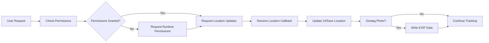

# Lab 6: Build a Location Tracking or Geotagging Application

Complete step-by-step guide.

## Lab Overview
In this lab, you'll build an Android application that tracks location using the Fused Location Provider API and optionally geotags photos with GPS coordinates. You'll learn to handle runtime permissions, manage location updates, and work with EXIF metadata for geotagging.

## Architecture Overview



## Step 1: Project Setup & Dependencies

### 1.1 Add Location Services Dependency
In your app-level `build.gradle.kts`, add the Google Play Services Location dependency:

```kotlin
dependencies {
    // Location services
    implementation("com.google.android.gms:play-services-location:21.3.0")
    
    // EXIF interface for geotagging
    implementation("androidx.exifinterface:exifinterface:1.3.7")
    
    // Coroutines for async operations
    implementation("org.jetbrains.kotlinx:kotlinx-coroutines-android:1.7.3")
    
    // Lifecycle components
    implementation("androidx.lifecycle:lifecycle-viewmodel-compose:2.7.0")
    implementation("androidx.lifecycle:lifecycle-runtime-compose:2.7.0")
}
```

### 1.2 Add Permissions to Manifest
Open `AndroidManifest.xml` and add the following permissions:

```xml
<uses-permission android:name="android.permission.ACCESS_COARSE_LOCATION" />
<uses-permission android:name="android.permission.ACCESS_FINE_LOCATION" />
<!-- For background location tracking (Android 10+) -->
<uses-permission android:name="android.permission.ACCESS_BACKGROUND_LOCATION" />
<!-- For foreground service notification (Android 8+) -->
<uses-permission android:name="android.permission.FOREGROUND_SERVICE" />
```

## Step 2: Implement Permission Handling

### 2.1 Create Permission Utility Class
Handle runtime permissions following Android best practices:

```kotlin
// LocationPermissionHelper.kt
import android.Manifest
import android.app.Activity
import android.content.Context
import android.content.pm.PackageManager
import androidx.activity.result.ActivityResultLauncher
import androidx.activity.result.contract.ActivityResultContracts
import androidx.compose.runtime.Composable
import androidx.compose.runtime.remember
import androidx.core.content.ContextCompat

class LocationPermissionHelper(private val activity: Activity) {
    
    private val permissionRequestLauncher: ActivityResultLauncher<Array<String>> = 
        activity.registerForActivityResult(
            ActivityResultContracts.RequestMultiplePermissions()
        ) { permissions ->
            val fineLocationGranted = permissions[Manifest.permission.ACCESS_FINE_LOCATION] ?: false
            val coarseLocationGranted = permissions[Manifest.permission.ACCESS_COARSE_LOCATION] ?: false
            
            onPermissionResult(fineLocationGranted || coarseLocationGranted)
        }
    
    private var onPermissionResult: (Boolean) -> Unit = {}
    
    fun checkLocationPermission(): Boolean {
        return ContextCompat.checkSelfPermission(
            activity,
            Manifest.permission.ACCESS_FINE_LOCATION
        ) == PackageManager.PERMISSION_GRANTED ||
        ContextCompat.checkSelfPermission(
            activity,
            Manifest.permission.ACCESS_COARSE_LOCATION
        ) == PackageManager.PERMISSION_GRANTED
    }
    
    fun requestLocationPermission(onResult: (Boolean) -> Unit) {
        onPermissionResult = onResult
        permissionRequestLauncher.launch(
            arrayOf(
                Manifest.permission.ACCESS_FINE_LOCATION,
                Manifest.permission.ACCESS_COARSE_LOCATION
            )
        )
    }
}
```

### 2.2 Compose Permission UI
Create a composable that handles permission requests:

```kotlin
// PermissionScreen.kt
@Composable
fun PermissionScreen(
    onPermissionResult: (Boolean) -> Unit
) {
    val context = LocalContext.current
    val permissionHelper = remember { LocationPermissionHelper(context as Activity) }
    
    LaunchedEffect(Unit) {
        if (permissionHelper.checkLocationPermission()) {
            onPermissionResult(true)
        } else {
            permissionHelper.requestLocationPermission { granted ->
                onPermissionResult(granted)
            }
        }
    }
    
    // Permission UI
    Column(
        modifier = Modifier
            .fillMaxSize()
            .padding(16.dp),
        verticalArrangement = Arrangement.Center,
        horizontalAlignment = Alignment.CenterHorizontally
    ) {
        Text(
            text = "Location permission is required for this app to work properly.",
            style = MaterialTheme.typography.titleLarge
        )
        
        Spacer(modifier = Modifier.height(16.dp))
        
        Button(
            onClick = {
                permissionHelper.requestLocationPermission { granted ->
                    onPermissionResult(granted)
                }
            }
        ) {
            Text("Request Permission")
        }
    }
}
```

## Step 3: Implement Location Tracking

### 3.1 Create Location Tracker Service
Use `FusedLocationProviderClient` for efficient location tracking:

```kotlin
// LocationTracker.kt
import android.content.Context
import android.location.Location
import android.os.Looper
import com.google.android.gms.location.FusedLocationProviderClient
import com.google.android.gms.location.LocationCallback
import com.google.android.gms.location.LocationRequest
import com.google.android.gms.location.LocationResult
import com.google.android.gms.location.LocationServices
import com.google.android.gms.location.Priority
import kotlinx.coroutines.channels.awaitClose
import kotlinx.coroutines.flow.Flow
import kotlinx.coroutines.flow.callbackFlow

class LocationTracker(private val context: Context) {
    
    private var fusedLocationClient: FusedLocationProviderClient = 
        LocationServices.getFusedLocationProviderClient(context)
    
    private var locationCallback: LocationCallback? = null
    
    fun getLocationUpdates(interval: Long = 5000): Flow<Location> = callbackFlow {
        val locationRequest = LocationRequest.Builder(
            Priority.PRIORITY_HIGH_ACCURACY,
            interval
        ).build()
        
        locationCallback = object : LocationCallback() {
            override fun onLocationResult(locationResult: LocationResult) {
                locationResult.lastLocation?.let { location ->
                    trySend(location)
                }
            }
        }
        
        try {
            fusedLocationClient.requestLocationUpdates(
                locationRequest,
                locationCallback!!,
                Looper.getMainLooper()
            )
        } catch (e: SecurityException) {
            close(e)
        }
        
        awaitClose {
            locationCallback?.let {
                fusedLocationClient.removeLocationUpdates(it)
            }
        }
    }
    
    fun getCurrentLocation(): Location? {
        // This is a simplified approach - use getLocationUpdates() for continuous tracking
        return null
    }
    
    fun stopLocationUpdates() {
        locationCallback?.let {
            fusedLocationClient.removeLocationUpdates(it)
        }
    }
}
```

### 3.2 Create Location ViewModel
Manage location state and coordinate with UI:

```kotlin
// LocationViewModel.kt
import android.app.Application
import android.location.Location
import androidx.lifecycle.AndroidViewModel
import androidx.lifecycle.viewModelScope
import kotlinx.coroutines.flow.MutableStateFlow
import kotlinx.coroutines.flow.StateFlow
import kotlinx.coroutines.flow.asStateFlow
import kotlinx.coroutines.launch

class LocationViewModel(application: Application) : AndroidViewModel(application) {
    
    private val locationTracker = LocationTracker(application)
    
    private val _locationState = MutableStateFlow<LocationState>(LocationState.Initial)
    val locationState: StateFlow<LocationState> = _locationState.asStateFlow()
    
    private val _currentLocation = MutableStateFlow<Location?>(null)
    val currentLocation: StateFlow<Location?> = _currentLocation.asStateFlow()
    
    init {
        startLocationTracking()
    }
    
    fun startLocationTracking() {
        viewModelScope.launch {
            _locationState.value = LocationState.Loading
            
            try {
                locationTracker.getLocationUpdates().collect { location ->
                    _currentLocation.value = location
                    _locationState.value = LocationState.Success(location)
                }
            } catch (e: Exception) {
                _locationState.value = LocationState.Error(e.message ?: "Unknown error")
            }
        }
    }
    
    fun stopLocationTracking() {
        locationTracker.stopLocationUpdates()
    }
    
    override fun onCleared() {
        super.onCleared()
        stopLocationTracking()
    }
}

sealed class LocationState {
    object Initial : LocationState()
    object Loading : LocationState()
    data class Success(val location: Location) : LocationState()
    data class Error(val message: String) : LocationState()
}
```

## Step 4: Implement Geotagging (Optional)

### 4.1 Extract EXIF Data from Photos
Android photos automatically record GPS coordinates when location services are enabled:

```kotlin
// ExifHelper.kt
import android.content.Context
import android.location.Location
import android.net.Uri
import androidx.exifinterface.media.ExifInterface
import java.io.InputStream

class ExifHelper(private val context: Context) {
    
    fun extractLocationFromImage(uri: Uri): Location? {
        try {
            context.contentResolver.openInputStream(uri)?.use { inputStream ->
                val exif = ExifInterface(inputStream)
                
                val lat = exif.getAttribute(ExifInterface.TAG_GPS_LATITUDE)
                val latRef = exif.getAttribute(ExifInterface.TAG_GPS_LATITUDE_REF)
                val lon = exif.getAttribute(ExifInterface.TAG_GPS_LONGITUDE)
                val lonRef = exif.getAttribute(ExifInterface.TAG_GPS_LONGITUDE_REF)
                
                if (lat != null && latRef != null && lon != null && lonRef != null) {
                    val latitude = convertToDegrees(lat)
                    val longitude = convertToDegrees(lon)
                    
                    // Adjust for direction reference
                    val finalLat = if (latRef == "S") -latitude else latitude
                    val finalLon = if (lonRef == "W") -longitude else longitude
                    
                    val location = Location("exif")
                    location.latitude = finalLat
                    location.longitude = finalLon
                    return location
                }
            }
        } catch (e: Exception) {
            // Handle exception
        }
        return null
    }
    
    fun addLocationToImage(uri: Uri, location: Location) {
        try {
            context.contentResolver.openOutputStream(uri)?.use { outputStream ->
                val exif = ExifInterface()
                
                // Set latitude
                val latDegree = location.latitude.toInt()
                val latMinute = ((location.latitude - latDegree) * 60).toInt()
                val latSecond = (((location.latitude - latDegree) * 60 - latMinute) * 60)
                
                exif.setAttribute(
                    ExifInterface.TAG_GPS_LATITUDE,
                    "$latDegree/1,$latMinute/1,$latSecond/1000"
                )
                exif.setAttribute(
                    ExifInterface.TAG_GPS_LATITUDE_REF,
                    if (location.latitude >= 0) "N" else "S"
                )
                
                // Set longitude
                val lonDegree = location.longitude.toInt()
                val lonMinute = ((location.longitude - lonDegree) * 60).toInt()
                val lonSecond = (((location.longitude - lonDegree) * 60 - lonMinute) * 60)
                
                exif.setAttribute(
                    ExifInterface.TAG_GPS_LONGITUDE,
                    "$lonDegree/1,$lonMinute/1,$lonSecond/1000"
                )
                exif.setAttribute(
                    ExifInterface.TAG_GPS_LONGITUDE_REF,
                    if (location.longitude >= 0) "E" else "W"
                )
                
                exif.saveAttributes()
            }
        } catch (e: Exception) {
            // Handle exception
        }
    }
    
    private fun convertToDegrees(string: String): Double {
        // Convert EXIF format to decimal degrees
        val parts = string.split(",")
        if (parts.size >= 3) {
            val degrees = parts[0].toDouble()
            val minutes = parts[1].toDouble()
            val seconds = parts[2].toDouble()
            
            return degrees + minutes / 60.0 + seconds / 3600.0
        }
        return 0.0
    }
}
```

## Step 5: Create UI with Jetpack Compose

### 5.1 Location Tracking Screen
Build the main screen that displays location information:

```kotlin
// LocationScreen.kt
@Composable
fun LocationScreen(
    viewModel: LocationViewModel = viewModel()
) {
    val locationState by viewModel.locationState.collectAsStateWithLifecycle()
    val currentLocation by viewModel.currentLocation.collectAsStateWithLifecycle()
    
    Column(
        modifier = Modifier
            .fillMaxSize()
            .padding(16.dp),
        verticalArrangement = Arrangement.spacedBy(16.dp)
    ) {
        // App title
        Text(
            text = "Location Tracker",
            style = MaterialTheme.typography.titleLarge,
            fontWeight = FontWeight.Bold
        )
        
        // Location status card
        Card(
            modifier = Modifier.fillMaxWidth(),
            colors = CardDefaults.cardColors(
                containerColor = MaterialTheme.colorScheme.primaryContainer
            )
        ) {
            Column(
                modifier = Modifier.padding(16.dp)
            ) {
                Text(
                    text = "Current Location",
                    style = MaterialTheme.typography.titleMedium
                )
                
                Spacer(modifier = Modifier.height(8.dp))
                
                when (locationState) {
                    is LocationState.Initial -> {
                        Text("Initializing...")
                    }
                    is LocationState.Loading -> {
                        CircularProgressIndicator(
                            modifier = Modifier.align(Alignment.CenterHorizontally)
                        )
                    }
                    is LocationState.Success -> {
                        val location = (locationState as LocationState.Success).location
                        LocationInfo(location = location)
                    }
                    is LocationState.Error -> {
                        val message = (locationState as LocationState.Error).message
                        Text(
                            text = "Error: $message",
                            color = MaterialTheme.colorScheme.error
                        )
                    }
                }
            }
        }
        
        // Controls
        Row(
            modifier = Modifier.fillMaxWidth(),
            horizontalArrangement = Arrangement.SpaceBetween
        ) {
            Button(
                onClick = { viewModel.startLocationTracking() }
            ) {
                Text("Start Tracking")
            }
            
            Button(
                onClick = { viewModel.stopLocationTracking() }
            ) {
                Text("Stop Tracking")
            }
        }
        
        // Map preview (simplified)
        Card(
            modifier = Modifier
                .fillMaxWidth()
                .height(200.dp)
        ) {
            currentLocation?.let { location ->
                // In a real app, you would integrate Google Maps here
                Text(
                    text = "Map Preview: ${location.latitude}, ${location.longitude}",
                    modifier = Modifier.padding(16.dp)
                )
            }
        }
    }
}

@Composable
fun LocationInfo(location: Location) {
    Column(
        modifier = Modifier.padding(8.dp)
    ) {
        Text(
            text = "Latitude: ${location.latitude}",
            style = MaterialTheme.typography.bodyLarge
        )
        Text(
            text = "Longitude: ${location.longitude}",
            style = MaterialTheme.typography.bodyLarge
        )
        Text(
            text = "Accuracy: ${location.accuracy}m",
            style = MaterialTheme.typography.bodyMedium
        )
        Text(
            text = "Time: ${formatTime(location.time)}",
            style = MaterialTheme.typography.bodyMedium
        )
    }
}

private fun formatTime(time: Long): String {
    val sdf = SimpleDateFormat("HH:mm:ss", Locale.getDefault())
    return sdf.format(Date(time))
}
```

## Step 6: Background Location Tracking (Advanced)

### 6.1 Use WorkManager for Periodic Updates
For background location tracking, use WorkManager with appropriate constraints:

```kotlin
// LocationWorker.kt
import android.content.Context
import android.location.Location
import androidx.work.CoroutineWorker
import androidx.work.WorkerParameters
import com.google.android.gms.location.FusedLocationProviderClient
import com.google.android.gms.location.LocationServices
import com.google.android.gms.location.Priority
import com.google.android.gms.tasks.Tasks
import kotlinx.coroutines.coroutineScope

class LocationWorker(
    context: Context,
    params: WorkerParameters
) : CoroutineWorker(context, params) {
    
    private var fusedLocationClient: FusedLocationProviderClient = 
        LocationServices.getFusedLocationProviderClient(context)
    
    override suspend fun doWork(): Result = coroutineScope {
        try {
            // Check if location permission is still granted
            if (!hasLocationPermission()) {
                return@coroutineScope Result.failure()
            }
            
            // Get current location
            val location = getCurrentLocation()
            
            // Process location update
            if (location != null) {
                // Save to database, send to server, etc.
                processLocationUpdate(location)
                Result.success()
            } else {
                Result.retry()
            }
        } catch (e: Exception) {
            Result.retry()
        }
    }
    
    private fun hasLocationPermission(): Boolean {
        // Implement permission check
        return true
    }
    
    private fun getCurrentLocation(): Location? {
        return try {
            val locationResult = Tasks.await(
                fusedLocationClient.getCurrentLocation(
                    Priority.PRIORITY_HIGH_ACCURACY,
                    null
                )
            )
            locationResult
        } catch (e: Exception) {
            null
        }
    }
    
    private fun processLocationUpdate(location: Location) {
        // Implement your location processing logic
        // This could include:
        // 1. Saving to local database
        // 2. Sending to server
        // 3. Updating widgets
        // 4. Triggering geofences
    }
}
```

### 6.2 Schedule Periodic Work
Set up periodic location updates with WorkManager:

```kotlin
// LocationScheduler.kt
import android.content.Context
import androidx.work.ExistingPeriodicWorkPolicy
import androidx.work.PeriodicWorkRequestBuilder
import androidx.work.WorkManager
import java.util.concurrent.TimeUnit

class LocationScheduler(private val context: Context) {
    
    fun schedulePeriodicLocationUpdates() {
        val locationWorkRequest = PeriodicWorkRequestBuilder<LocationWorker>(
            15, TimeUnit.MINUTES // Minimum interval is 15 minutes
        )
            .setConstraints(
                Constraints.Builder()
                    .setRequiresBatteryNotLow(true)
                    .build()
            )
            .build()
        
        WorkManager.getInstance(context).enqueueUniquePeriodicWork(
            "location_updates",
            ExistingPeriodicWorkPolicy.KEEP,
            locationWorkRequest
        )
    }
    
    fun cancelPeriodicLocationUpdates() {
        WorkManager.getInstance(context).cancelUniqueWork("location_updates")
    }
}
```

## Step 7: Testing the Implementation

Unit Tests Example
```kotlin
// LocationTrackerTest.kt
class LocationTrackerTest {
    
    @get:Rule
    val instantTaskExecutorRule = InstantTaskExecutorRule()
    
    private lateinit var locationTracker: LocationTracker
    private lateinit var mockFusedLocationClient: FusedLocationProviderClient
    
    @Before
    fun setup() {
        mockFusedLocationClient = mockk()
        locationTracker = LocationTracker(ApplicationProvider.getApplicationContext())
    }
    
    @Test
    fun `getLocationUpdates returns flow of locations`() = runTest {
        // Given
        val mockLocation = Location("test").apply {
            latitude = 37.7749
            longitude = -122.4194
            accuracy = 10f
            time = System.currentTimeMillis()
        }
        
        // When
        val locationFlow = locationTracker.getLocationUpdates()
        
        // Then
        locationFlow.collect { location ->
            assertEquals(mockLocation.latitude, location.latitude, 0.001)
            assertEquals(mockLocation.longitude, location.longitude, 0.001)
        }
    }
}
```

## Step 8: Advanced Features

<summary> Advanced Implementation Details</summary>

### 8.1 Geofencing
Implement geofencing for location-based notifications:

```kotlin
// GeofenceHelper.kt
import android.content.Context
import com.google.android.gms.location.Geofence
import com.google.android.gms.location.GeofencingClient
import com.google.android.gms.location.GeofencingRequest
import com.google.android.gms.location.LocationServices

class GeofenceHelper(private val context: Context) {
    
    private var geofencingClient: GeofencingClient = 
        LocationServices.getGeofencingClient(context)
    
    fun addGeofence(
        requestId: String,
        latitude: Double,
        longitude: Double,
        radiusMeters: Float
    ) {
        val geofence = Geofence.Builder()
            .setRequestId(requestId)
            .setCircularRegion(latitude, longitude, radiusMeters)
            .setExpirationDuration(Geofence.NEVER_EXPIRE)
            .setTransitionTypes(Geofence.GEOFENCE_TRANSITION_ENTER or Geofence.GEOFENCE_TRANSITION_EXIT)
            .build()
        
        val geofencingRequest = GeofencingRequest.Builder()
            .addGeofence(geofence)
            .setInitialTrigger(GeofencingRequest.INITIAL_TRIGGER_ENTER)
            .build()
        
        geofencingClient.addGeofences(geofencingRequest, geofencePendingIntent)
            .addOnSuccessListener {
                // Geofence added successfully
            }
            .addOnFailureListener {
                // Handle failure
            }
    }
}
```

### 8.2 Location History Visualization
Implement a map with location history:

```kotlin
// LocationHistoryMap.kt
@Composable
fun LocationHistoryMap(
    locations: List<Location>
) {
    // Integrate Google Maps SDK
    // Show all locations as markers on the map
    // Draw polyline connecting locations in chronological order
}
```

### 8.3 Background Service with Notification
Implement foreground service for continuous background tracking:

```kotlin
// LocationTrackingService.kt
import android.app.Notification
import android.app.NotificationChannel
import android.app.NotificationManager
import android.app.Service
import android.content.Intent
import android.os.IBinder

class LocationTrackingService : Service() {
    
    override fun onCreate() {
        super.onCreate()
        createNotificationChannel()
        startForeground(NOTIFICATION_ID, createNotification())
    }
    
    private fun createNotificationChannel() {
        // Create notification channel for Android 8.0+
    }
    
    private fun createNotification(): Notification {
        // Create notification for foreground service
    }
    
    override fun onBind(intent: Intent?): IBinder? = null
}
```

## Performance Optimization

| Optimization Technique | Description | Impact |
|------------------------|-------------|--------|
| **Efficient Location Requests** | Use `Priority.PRIORITY_BALANCED_POWER_ACCURACY` instead of `PRIORITY_HIGH_ACCURACY` when high accuracy isn't needed | Battery |
| **Batch Updates** | Collect multiple location updates before processing | Network, Battery |
| **Smart Intervals** | Adjust update interval based on device movement (detect stationary vs. moving) | Battery |
| **Location Caching** | Cache last known location to reduce API calls | Performance |
| **Geofence Optimization** | Use geofences instead of continuous tracking when possible | Battery |

## Next Steps

1. **Integrate Google Maps SDK** for real map visualization
2. **Implement location history** with Room database
3. **Add geofencing** for location-based notifications
4. **Implement location sharing** with other users
5. **Add offline support** for location caching
6. **Implement location-based search** using Places API
7. **Add route tracking** with distance and speed calculations